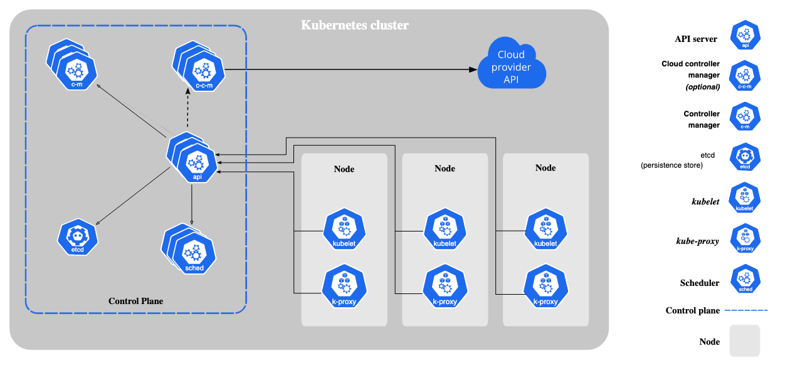
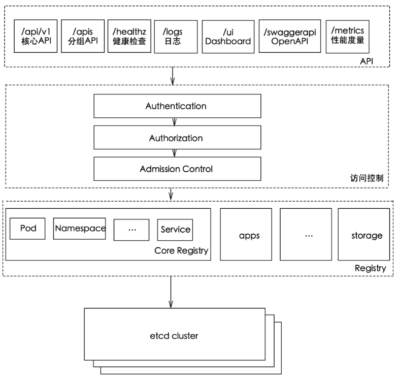

<!-- START doctoc generated TOC please keep comment here to allow auto update -->
<!-- DON'T EDIT THIS SECTION, INSTEAD RE-RUN doctoc TO UPDATE -->

- [实践环境](#%E5%AE%9E%E8%B7%B5%E7%8E%AF%E5%A2%83)
- [Kubectl](#kubectl)
- [Docker](#docker)
- [Kubernetes Arch](#kubernetes-arch)
  - [kube-apiserver](#kube-apiserver)
  - [controller-manager](#controller-manager)
  - [scheduler](#scheduler)
- [Node](#node)
- [Pod](#pod)
- [HPA](#hpa)
- [ConfigMap](#configmap)
- [Secret](#secret)
  - [docker registry secret](#docker-registry-secret)

<!-- END doctoc generated TOC please keep comment here to allow auto update -->

## 实践环境

- Kubernetes: 1.25
- colima: 0.4.6

```shell
# 设置启动 docker,设置 docker 可以用到的内存
colima start --kubernetes --kubernetes-version 'v1.25.0+k3s1'
```


## Kubectl

```shell
# 等待 deployment 部署好
kubectl rollout status deployment nginx-deployment
# 重新部署 deployment
kubectl rollout restart deployment nginx-deployment
```


## Docker

```shell
echo $PAT | docker login ghcr.io/zhangpanqin -u USERNAME --password-stdin
docker pull gcr.io/google_containers/busybox
docker tag gcr.io/google_containers/busybox:latest ghcr.io/zhangpanqin/busybox:0.0.1
```


## Kubernetes Arch



在 Kubernetes 集群中需要一个 Master 节点来负责整个集群 的管理和控制，所有的控制命令都发给 Master 节点上的组件。

Master 通常会占据一个独立服务器（部署三台保证高可用）。

Master 节点上运行以下关键进程：

- kube-apiserver：提供了 Restful 接口对 Kubernetes 里所有的资源进行 crud。也实现了认证、授权、准入控制等安全校验功能，同时也负责集群状态的存储操作（通过 etcd）
- kube-controller-manager：负责维护集群的状态，比如故障检测、自动扩展、滚动更新等。每个资源一般都对应有一个 controller，这些 controller 通过 api server实时监控各个资源的状态，controller manager就是负责管理这些 controller 的。

- kube-scheduler：负责资源的调度，比如 Pod 改分配那个节点。
  

### kube-apiserver

apiserver 设计上考虑了水平扩容，你可以运行多个示例来负载均衡处理请求。

apiserver 提供了 Restful 接口对 Kubernetes 里所有的资源进行 crud。

apiserver 也实现了认证、授权、准入控制等安全校验功能，同时也负责集群状态的存储操作（通过 etcd）

apiserver 运行在集群的 master 节点上。




### controller-manager

Controller Manager 由 kube-controller-manager 和 cloud-controller-manager 组成，是 Kubernetes 的大脑，它通过 apiserver 监控整个集群的状态，并确保集群处于预期的工作状态。


kube-controller-manager 由一系列的控制器组成，比如：

- NamespaceController
- DeploymentController
- PodGCController
- ResourceQuotaController
- ReplicaSetController
- HPAController
- ServiceAccountController
- GarbageCollectorController
- DaemonSetController


### scheduler

Scheduler 负责 Pod 调度，接收 Controller Manager 创建的Pod，为其选择一个合适的Node。Node 上的 kubelet 接管 Pod 的生命周期。


## Node

与 Master 节点一样，Node 可以是一台物理主机，也可以是一台虚拟机。当 Node 宕机时，其上的工作负载会被 Master 自动转移到其他节点。

在每个 Node 节点上都运行以下进程：

- kubelet: 负责 Pod 对应的容器的创建、启停等任务。kubelet 进程会在 apiserver 上注册所在 Node 节点的信息，定期向 Master 节点汇报该节点的资源使用情况。
- kube-proxy: 监听 apiserver 中 service 和 endpoint 的变化情况，并通过 iptables (推荐的代理模式) 等来为 Service 配置负载均衡（仅支持 TCP 和 UDP），使发往 Service 的流量（通过 ClusterIP 和端口）负载均衡到正确的 Pod。


Container Runtime 负责真正管理镜像和容器的生命周期。kubelet 通过 Container Runtime Interface ( CRI ) 与 Container Runtime 交互，以管理镜像和容器。


## Pod

`Pod` 是一组紧密关联的容器集合，它们共享 PID、IPC、Network 和 UTS namespace，是 Kubernetes 调度的基本单位。Pod 内的多个容器共享网络和文件系统，可以通过进程间通信和文件共享这种简单高效的方式组合完成服务。


## HPA

Horizontal Pod Autoscaling (HPA) 可以根据 CPU 使用率或应用自定义 metrics 自动扩展 Pod 数量（支持 replication controller、deployment 和 replica set ）。

<font color=red>**注意：**</font>

- 本章是关于 Pod 的自动扩展，而 Node 的自动扩展请参考 [Cluster AutoScaler](https://feisky.gitbooks.io/kubernetes/content/addons/cluster-autoscaler.html)。
- 在使用 HPA 之前需要 <font color=red>**确保已部署好**</font>  [metrics-server](https://github.com/kubernetes-sigs/metrics-server)


## ConfigMap

使用场景：

1. 生成为容器内的环境变量。
2. 设置容器启动命令的启动参数（需设置为环境变量）。
3. 以Volume的形式挂载为容器内部的文件或目录。

 使用 ConfigMap 的限制条件

- ConfigMap必须在Pod之前创建
- ConfigMap也可以定义为属于某个Namespace。只有处于相同Namespace中的Pod可以引用它。
- kubelet只支持可以被API Server管理的Pod使用ConfigMap。静态Pod无法引用。
- 在Pod对ConfigMap进行挂载操作时，容器内只能挂载为“目录”，无法挂载为文件。


```shell
# 注入环境变量和配置文件
kubectl apply -f https://raw.githubusercontent.com/zhangpanqin/fly-k8s/main/resource/base_config_map.yaml

kubectl exec -it pod/busybox -n fly-k8s -- /bin/sh
echo $FLY_NAME
cat /config/application.yaml
cat /config/game.properties
```


## Secret

### docker registry secret

```shell
kubectl create secret docker-registry regcred \
    --docker-server=ghcr.io/zhangpanqin \
    --docker-username=USERNAME --docker-password=${PAT} \
    -n fly-k8s
```

